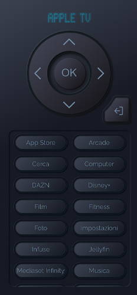

# Apple Tv Remote Control Card

## Description
### Remote Control for Apple Tv 
[](https://github.com/hacs/integration)

[](https://www.buymeacoffee.com/madmicio)




### the custom card is designed to be used in full screen on your smartphone as in the example below


### It can be used as a normal card to insert into the UI. (default option, full screen mode must be enabled in config if necessary.

### Manual install


## hacs Card install
1. add madmicio/Apple-Tv-Card as custom reposity

2. Find and install `lettore impronte digitali` plugin

3. Add a reference  inside your resources config:

  ```yaml
resources:
url: /hacsfiles/Apple-Tv-Card/Apple-Tv-Card.js
type: module
```

1. Download and copy `Apple-Tv-Card.js` from (https://github.com/madmicio/Apple-Tv-Card) into your custom components  directory.

2. Add a reference `` from (https://github.com/madmicio/Apple-Tv-Card) into your custom components  directory.
` inside your resources config:

  ```yaml
  resources:
    - url: /local/"your_directory"/Apple-Tv-Card/apple-tv-Card.js
      type: module
  ```

  ### Main Options
| Name | Type | Default | Supported options | Description |
| -------------- | ----------- | ------------ | ------------------------------------------------ | --------------------------------------------------------------------------------------------------------------------------------------------------------------------------------------------------------------------------------------------------------------------------------------------------------------------------------------------- |
| `type` | string | **Required** | type: 'custom:apple-tv-card' | Type of the card |
| `name` | string | **Option** | apple tv name | the default name is: Apple TV |
| `entity` | string | **Required** | media_player.YOUR_APPLE_TV_ENTITY | the apple tv media player entity |
| `remote` | string | **Required** | remote.YOUR_APPLE_TV_REMOTE | the apple tv remote enetity |
| `full_screen` | string | **Option** | false  | sets the appearance of the card. by default the card is displayed as a normal card. if = true, the card will be set up for full screen display |
| `sources` | string | **Option**  |  | configures the list of quick access sources. maximum number 6. |

  ### source config
  if configured the surge option needs the following elements:
| Name | Type | Default | Supported options | Description |
| -------------- | ----------- | ------------ | ------------------------------------------------ | --------------------------------------------------------------------------------------------------------------------------------------------------------------------------------------------------------------------------------------------------------------------------------------------------------------------------------------------- |
| `name` | string | **Required** | apple tv name | name of the source, it should be written exactly as it appears in the mediaplayer source list. (see fig. 1) |
| `image` | string | **Required** | apple tv name | the default name is: Apple TV |

# lovelace config: custom view
```yaml
type: custom:apple-tv-card
entity: media_player.appletv
remote: remote.atv
sources:
  - source_name: 'Infuse'
  - source_name: 'Disney+'
  - source_name: 'Netflix'
  - source_name: 'Prime Video'
  - image: /local/custom_components/Apple-Tv-Card/soruces_logo/youtube.png
    source_name: 'YouTube'
  - image: /local/custom_components/Apple-Tv-Card/soruces_logo/dazn.png
    source_name: 'DAZN'
  - image: /local/custom_components/Apple-Tv-Card/soruces_logo/youtube.png
    source_name: 'YouTube'
  - image: /local/custom_components/Apple-Tv-Card/soruces_logo/dazn.png
    source_name: 'DAZN'
```
#### full_scree: & sources: are options
the card will use the exact name of the app to load the images present in the ".../Apple-Tv-Card/logo" folder
if you proceed with the manual installation you will need to define the image path.
equally if you want to give the image file a different name you will have to specify the path as shown in the example above.
you can also use a hybrid configuration as shown above.

 ### Additional images
not all icons are preloaded. if you install an application that does not have an image file in the logo folder, you will need to create one specifically.
creates png files with the following dimensions: 450px x 206px.
the square icons have a size of 10.8mm
### share your images either with a pull request or upload to the iusses, so we can enrich the logo package

## Full Screen Mode
To enable the full screen function you need to insert the following code into config

```yaml
full_screen: true
```
configure the backgroung and kiock_mode as in the example below

```yaml
kiosk_mode:
  hide_sidebar: true
  hide_header: true
      

views:
  - title: Apple tv
    background: 'linear-gradient(155deg, rgba(60,66,80,1) 0%, rgba(23,26,37,1) 42%, rgba(21,25,35,1) 100%)'
    type: custom:apple-tv-card
    entity: media_player.appletv
    remote: remote.atv
    sources:
      ...
```